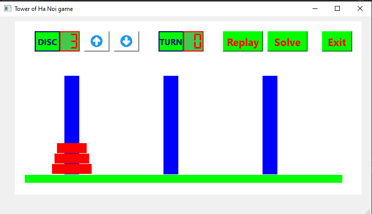
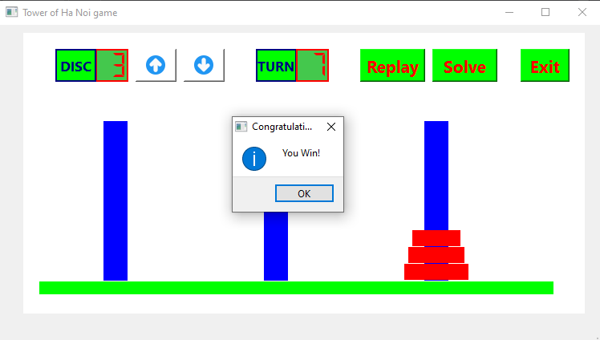

# Tower of Hanoi Game

This is a simple implementation of the **Tower of Hanoi** game using **C++** and **Qt Framework**. The game allows players to solve the Tower of Hanoi puzzle manually or view the solution automatically.

---

## Features

- **Interactive Gameplay**: Move discs between poles manually.
- **Automatic Solve**: View the optimal solution for the puzzle.
- **Adjustable Disc Count**: Increase or decrease the number of discs dynamically.
- **Track Moves**: A counter displays the number of moves made.
- **Replay Option**: Reset the game and start over.
- **Exit Confirmation**: Prompts before exiting the game.

---

## Installation

### Prerequisites

- **Qt Creator** installed on your system.
- A working C++ compiler (comes with Qt Creator).

### Steps

1. Clone the repository:
   ```bash
   git clone https://github.com/RutoNguyen/Tower_of_HaNoi_Game.git
   cd TowerOfHanoi
   ```

2. Open the `.pro` file in **Qt Creator**.

3. Build and run the project:
   - Click the **Run** button or press `Ctrl + R`.

---

## How to Play

1. Start the game by choosing the number of discs (default is 3).
2. Use the mouse to move discs between the poles by clicking on them.
3. Try to move all the discs from the leftmost pole to the rightmost pole while following the rules:
   - Only one disc can be moved at a time.
   - A disc can only be placed on an empty pole or on top of a larger disc.
4. Use the **Replay** button to reset or **Solve** button to view the optimal solution.

---

## Controls

| Button     | Functionality                     |
|------------|-----------------------------------|
| `↑`        | Increase the number of discs.     |
| `↓`        | Decrease the number of discs.     |
| `Replay`   | Restart the game.                 |
| `Solve`    | Automatically solve the puzzle.   |
| `Exit`     | Exit the game (with confirmation).|

---

## Screenshot

### Start Game



### Win Game



---

## Contributing

Feel free to fork this repository and contribute to the project. Pull requests are welcome!

---

## License

This project is licensed under the MIT License. See the [LICENSE](LICENSE) file for details.

---

## Contact

For questions or feedback, feel free to reach out at:
- **Email**: [rutonguyenhuu@gmail.com]
- **GitHub**: [https://github.com/RutoNguyen]
